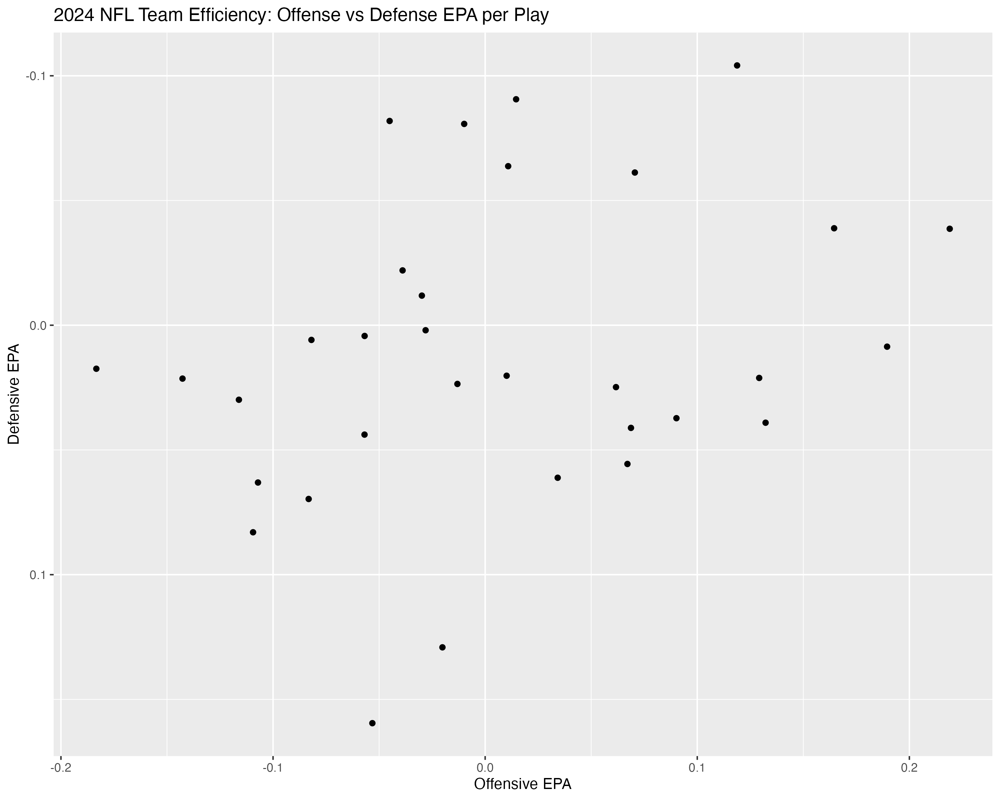

# NFL Team Efficiency

An analysis of 2024 NFL team efficiency using EPA per play, visualizing offensive and defensive performance.

# What is EPA?

EPA stands for Expected Points Added. It measures how many points are added per play or drive, whichever metric you want to measure. It is a useful statistic because you can add value to counting stats. For example, a 6 yard completion will go down on the score sheet as a 6 yard pass, it doesn't take into account whether that was on 3rd and 5, or 3rd and 10, or 2nd and 6 etc. EPA measures the context of the situation, a 6 yard completion on 3rd and 5 is more valuable than a 6 yard completion on 3rd and 10 because the completion on 3rd and 5 gives you a first down whereas the completion on 3rd and 10 gives you fourth down and a potential punt. The higher the EPA for an offense, the better they are. The same logic can be applied to the defensive side of the ball. A tackle goes down on the score sheet as a tackle. However a touchdown saving tackle on the goal line is more valuable than a tackle on 1st and 10. The lower the EPA for a defense, the better they are.

# The Analysis:

I pulled Play-by-Play data from the nflreadr package. I computed the mean EPA per play for each team's offense and defense for run and pass plays. I then joined the two tables and created the chart below.



# How to Read the Chart:

This chart shows the offensive and defensive EPA for every team in the league in 2024. You can separate this chart into quadrants. If a team is in the top left quadrant, it means they have a good-to-great defense but a poor offense, example is the Houston Texans. If a team is in the bottom left quadrant, it means they have a poor offense and defense, example Carolina Panthers. If a team is in the bottom right quadrant it means they have a good-to-great offense but poor defense, example Washington Commanders. Finally, if a team is in the top right quadrant it means they have a good-to-great offense and defense (a complete team), example the Baltimore Ravens. Notably, only a handful of teams had above average offenses and defenses in 2024. Above average meaning positive EPA for offense and negative EPA for defense.
# How to Run:

You need nflreadr, tidyverse, and nflplotr to reproduce. Here is the script:

``` r
library(nflreadr)
library(tidyverse)
library(nflplotR)

pbp <- load_pbp(2024)

filtered_off_epa_pbp <- pbp %>%
  rename(team = posteam) %>%
  filter(play_type %in% c("run", "pass")) %>%
  group_by(team) %>% 
  summarize(off_epa = mean(epa, na.rm = TRUE))

filtered_def_epa_pbp <- pbp %>%
  rename(team = defteam) %>%
  filter(play_type %in% c("run", "pass")) %>%
  group_by(team) %>%
  summarize(def_epa = mean(epa, na.rm = TRUE))

combined_epa <- full_join(filtered_off_epa_pbp, filtered_def_epa_pbp, by = join_by(team))

ggplot(combined_epa, aes(x = off_epa, y = def_epa)) +
  geom_nfl_logos(aes(team_abbr = team), width = 0.04) +
  scale_y_reverse()+
  labs(title = "2024 NFL Team Efficiency: Offense vs Defense EPA per Play", y="Defensive EPA", x="Offensive EPA")
ggsave("output/epa_quadrant_2024.png", width = 10, height = 8, dpi = 300)
```
